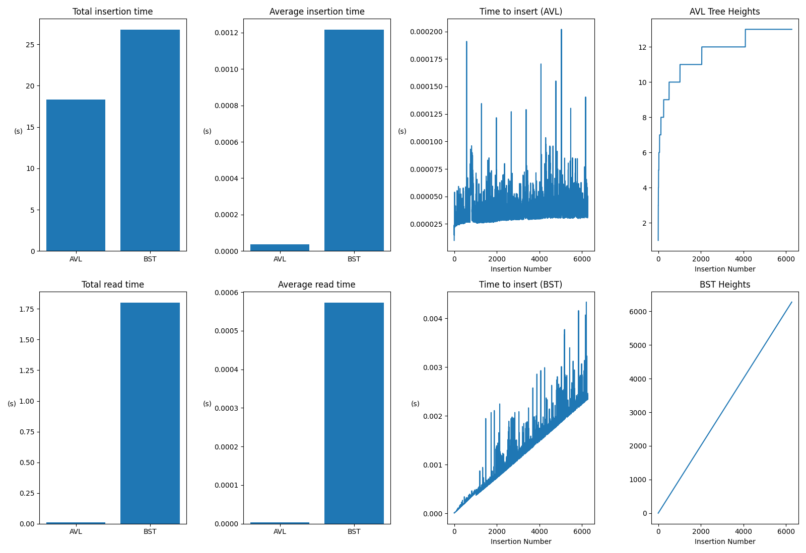

# Experimentos com AVL e BST

Linguagem: Python 3.10.10

## Libs
- pandas: https://pandas.pydata.org/docs/
- bintress: https://pypi.org/project/bintrees/
- matplotlib: https://matplotlib.org/stable/index.html
- time: https://docs.python.org/3/library/time.html

## Dados
- [x] Baixar [CSV com série temporal de preços de Bitcoin](https://www.kaggle.com/datasets/aakashverma8900/bitcoin-price-usd)

## AVL
- Complexidade de tempo de busca (pior e médio casos) : O(log n)
- Complexidade de tempo de escrita (pior e médio casos): O(log n)

- [x] Escrever rotinas para ler o arquivo e mapear os dados em uma AVL
  - Gravar tempo de cada inserção - plotar por inserção, tempo mínimo, máximo e médio
  - [x] Escrever rotinas para buscar

## BST
- Complexidade de tempo de busca (pior e médio casos, respectivamente) : O(n) e O(log n)
- Complexidade de tempo de escrita (pior e médio casos, respectivamente): O(n) e O(log n)

- [x] Escrever rotinas para ler o arquivo e mapear os dados em uma Árvore Binária de Busca
  - Gravar tempo de cada inserção - plotar por inserção, tempo mínimo, máximo e médio
  - [x] Escrever rotinas para buscar

## Apresentação
- [x] Criar gráficos, tabelas ou outros recursos para demonstrar resultados comparativos de desempenho entre a Árvore Binária de Busca e AVL.

- [ ] Discutir como seria montada cada árvore com buscar feitas por outro campo que não seja a chave.
 
